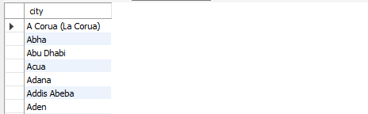
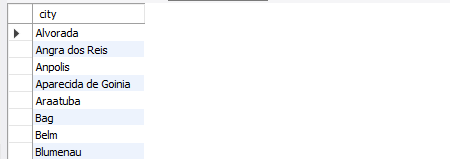
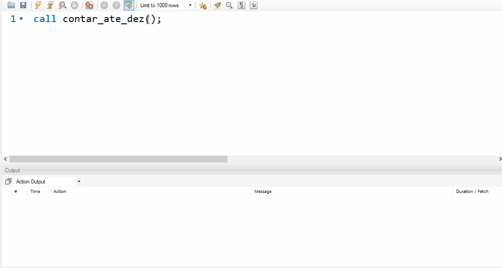
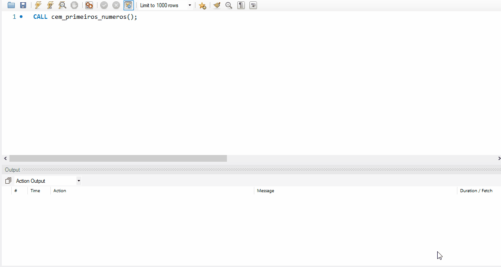
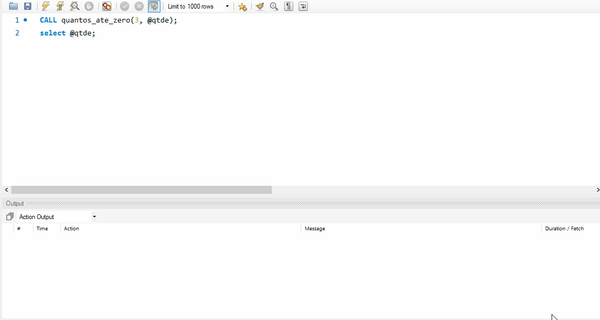

# MySQL - Sintaxes _Stored Routines_

* [📽 Veja esta vídeo-aula no Youtube](https://youtu.be/fVBcOw8ps3E)
* [📚 Referência oficial](https://dev.mysql.com/doc/refman/8.0/en/sql-compound-statements.html "Documentação oficial - Compound Statement Syntax")
* [⁉ FAQ - _Frequently Asked Questions_](https://dev.mysql.com/doc/refman/8.0/en/faqs-stored-procs.html "Perguntas gerais")

Índice

* [Parâmetros](#Parâmetros "Parâmetros")
  * [Parâmetros IN](#Parâmetros-IN "Parâmetros IN")
  * [Parâmetros OUT](#Parâmetros-OUT "Parâmetros OUT")
  * [Parâmetros INOUT](#Parâmetros-INOUT "Parâmetros INOUT")
* [Variáveis](#Variáveis "Variáveis")
* [Controle de fluxo - decisão e laços](#Controle-de-fluxo---decisão-e-laços "Controle de fluxo - decisão e laços")
  * [Decisão Simples - IF](#Decisão-Simples---IF "Decisão Simples - IF")
  * [Decisão Múltipla - CASE](#Decisão-Múltipla---CASE "Decisão Múltipla - CASE")
  * [Laços - Loop..End](#Laços---LOOP..END "Laços - Loop..End")
  * [Laços - Repeat..Until](#Laços---REPEAT..UNTIL "Laços - Repeat..Until")
  * [Laços - While..Do](#Laços---WHILE..DO "Laços - While..Do")

## Parâmetros

<https://dev.mysql.com/doc/refman/8.0/en/create-procedure.html>

### Sintaxe - Parâmetros

```sql
#Parâmetros para procedure:
    [ IN | OUT | INOUT ] param_name type

#Parâmetros para function:
    param_name type
```

### Parâmetros IN

Um parâmetro **IN** passa um **valor** para uma _procedure_ ou _function_. Ainda que o valor seja modificado no corpo de uma _procedure_ ou _function_, este **não será visível** ao executor ao final do procedimento.

Como padrão, todo e qualquer parâmetro é de entrada (IN), caso não seja especificado.

_Functions_ aceitam somente parâmetros de entrada.

#### Sintaxe - Parâmetros IN

```sql
[ IN ] param_name type
```

#### Exemplo - Declarando parâmetros IN

```sql
#Em procedure
CREATE PROCEDURE hello_world (IN user varchar(30))
#ou
CREATE PROCEDURE hello_world (x varchar(30))

#Em function
CREATE FUNCTION hello_world (x varchar(30))
```

#### Exemplo - Usando parâmetros IN

```sql
DELIMITER $$
DROP PROCEDURE IF EXISTS hello_world$$
CREATE PROCEDURE hello_world(IN usuario VARCHAR(30))
BEGIN
   SELECT CONCAT('olá, ', usuario);
END;
$$
```

#### Exemplo - Execução com parâmetros IN

```sql
CALL hello_world('João')
```

### Parâmetros OUT

Um parâmetro de saída **OUT** é retornado de uma  _procedure_ para seu executor. Seu valor inicial é NULL dentro da _procedure_ e o seu valor é visível para o executor ao final da execução da procedure.

Se a _procedure_ falhar em sua execução, o parâmetro **OUT** não é retornado ao executor.

_Functions_ **não** aceitam somente parâmetros de saída (OUT).

#### Sintaxe - Parâmetros OUT

```sql
[ OUT ] param_name type
```

#### Exemplo - Declarando parâmetros OUT

```sql
#Boa prática: IN, depois OUT
CREATE PROCEDURE nome_completo
   (IN nome VARCHAR(30)
   , IN sobrenome VARCHAR(30)
   , OUT nome_completo VARCHAR(60))
```

#### Exemplo - Usando parâmetros OUT

```sql
DELIMITER $$
DROP PROCEDURE IF EXISTS nome_completo$$
CREATE PROCEDURE nome_completo
   (IN nome VARCHAR(30)
   , IN sobrenome VARCHAR(30)
   , OUT nome_completo VARCHAR(60))
BEGIN
   SELECT CONCAT(nome, ' ', sobrenome)
     INTO nome_completo;
END;
$$
```

#### Exemplo - Execução com parâmetros OUT

```sql
SET @nomecompleto = '';
CALL nome_completo('Diego','Neri', @nomecompleto);
SELECT @nomecompleto;
```

### Parâmetros INOUT

Um parâmetro de entrada e saída **INOUT** é inicializado pelo executor, pode ser alterado ou não pela _procedure_, sendo as alterações realizadas visíveis ao executor ao final da execução da _procedure_.

Se a _procedure_ falhar em sua execução, o parâmetro **INOUT** não é retornado ao executor.

_Functions_ **não** aceitam somente parâmetros de entrada e saída (INOUT).

#### Sintaxe - Parâmetros INOUT

```sql
[ INOUT ] param_name type
```

#### Exemplo - Declarando parâmetros INOUT

```sql
#Boa prática: IN, depois OUT, depois INOUT
CREATE PROCEDURE acumula_valor
   (INOUT x int)
```

#### Exemplo - Usando parâmetros INOUT

```sql
DELIMITER $$
DROP PROCEDURE IF EXISTS acumula_valor$$
CREATE PROCEDURE acumula_valor
   (INOUT x int)
BEGIN
   SELECT x + 1
     INTO x;
END;
$$
```

#### Exemplo - Execução com parâmetros INOUT

```sql
SET @valor = 10;
CALL acumula_valor(@valor);
SELECT @valor;
```

## Variáveis

<https://dev.mysql.com/doc/refman/8.0/en/stored-program-variables.html>

### Sintaxe - Variáveis

```sql
DECLARE var_name [, var_name] ... type [DEFAULT value]
```

### Exemplo - Variáveis

```sql
#Declaração única
DECLARE x int;

#Declaração múltipla
DECLARE x,y,z int;

#Declaração com default
DECLARE x int DEFAULT 0;
DECLARE x,y,z int DEFAULT 0;
```

No bloco

```sql
DELIMITER $$
DROP PROCEDURE IF EXISTS teste_variavel$$
CREATE PROCEDURE teste_variavel()
BEGIN
   DECLARE x INT;
   SET x = 100;
   SELECT x-1 AS anterior, x AS entrada, x+1 AS proximo;
END;
$$
----------------------------------------------------------------
CALL `teste_variavel`()
```

## Controle de fluxo - decisão e laços

<https://dev.mysql.com/doc/refman/8.0/en/flow-control-statements.html>

O MySQL suporta as estruturas _IF_, _CASE_, _ITERATE_, _LEAVE_, _LOOP_, _WHILE_, e _REPEAT_ para tomadas de decisão e repetição em programas armazenados. Para _functions_, também é suportada a instrução _RETURN_.

As seções abaixo abordam a sintaxe básica dos comandos listados, alguns deles contidos em mais de uma situação.

O MySQL **não suporta** o laço FOR.

### Decisão Simples - IF

<https://dev.mysql.com/doc/refman/8.0/en/if.html>

#### Sintaxe - IF

```sql
IF search_condition THEN statement(s)
[ELSEIF search_condition THEN statement(s)]
...
[ELSE statement(s)]
END IF
```

#### Exemplo - IF

```sql
DELIMITER $$
DROP PROCEDURE IF EXISTS cidades_do_pais$$
CREATE PROCEDURE cidades_do_pais(IN pais VARCHAR(50))
BEGIN
   IF (pais = '') THEN
      SELECT c.city
        FROM city c;
   ELSE
      SELECT c.city
        FROM city c
       WHERE c.country_id = (
         SELECT c1.country_id
           FROM country c1
          WHERE c1.country = pais
       );
   END IF;
END;
$$
```

#### Execução - IF

```sql
CALL cidades_do_pais('');
```



```sql
CALL cidades_do_pais('Brazil');
```



### Decisão Múltipla - CASE

<https://dev.mysql.com/doc/refman/8.0/en/case.html>

#### Sintaxe - CASE

```sql
CASE case_value
   WHEN when_value THEN statement
   [WHEN when_value THEN statement ...]
   [ELSE statement]
END CASE
```

ou

```sql
CASE
   WHEN search_condition THEN statement
   [WHEN search_condition THEN statement ...]
   [ELSE statement]
END CASE
```

### Laços - LOOP..END

<https://dev.mysql.com/doc/refman/8.0/en/loop.html>

#### Sintaxe - LOOP..END

```sql
[begin_label:] LOOP
    statement_list
END LOOP [end_label]
```

#### Exemplo - LOOP..END

```sql
DELIMITER $$
DROP PROCEDURE IF EXISTS contar_ate_dez$$
CREATE PROCEDURE contar_ate_dez()
BEGIN
  DECLARE num int DEFAULT 0;
  labelAteDez: LOOP
    SET num = num + 1;
    IF num <= 10 THEN
      SELECT CONCAT('Número --> ', num);
      ITERATE labelAteDez;
    END IF;
    LEAVE labelAteDez;
  END LOOP labelAteDez;
END;
$$
DELIMITER ;
```



### Laços - REPEAT..UNTIL

<https://dev.mysql.com/doc/refman/8.0/en/loop.html>

#### Sintaxe - REPEAT..UNTIL

```sql
[begin_label:] REPEAT
    statement_list
UNTIL search_condition
END REPEAT [end_label]
```

#### Exemplo - REPEAT..UNTIL

```sql
DELIMITER $$
DROP PROCEDURE IF EXISTS cem_primeiros_numeros$$
CREATE PROCEDURE cem_primeiros_numeros()
BEGIN
  DECLARE num int DEFAULT 0;
  REPEAT
    SET num = num + 1;
    UNTIL num >= 100
  END REPEAT;
  SELECT num;
END;
$$
DELIMITER ;
```

```sql
CALL cem_primeiros_numeros();
```



### Laços - WHILE..DO

<https://dev.mysql.com/doc/refman/8.0/en/while.html>

#### Sintaxe - WHILE..DO

```sql
[begin_label:] WHILE search_condition DO
    statement_list
END WHILE [end_label]
```

#### Exemplo - WHILE..DO

```sql
DELIMITER $$
DROP PROCEDURE IF EXISTS quantos_ate_zero$$
CREATE PROCEDURE quantos_ate_zero(IN num int, OUT quantidade int)
BEGIN
   DECLARE v_quantidade int;
   IF num <= 0 THEN
      SELECT 0
        INTO quantidade;
   ELSE
     SET v_quantidade = 0;
     WHILE num > 0 DO
        SET v_quantidade = v_quantidade + 1;
        SET num = num - 1;
     END WHILE;
     SELECT v_quantidade
        INTO quantidade;
   END IF;
END;
$$
DELIMITER ;
```

```sql
CALL quantos_ate_zero(3, @qtde);
select @qtde;
```


