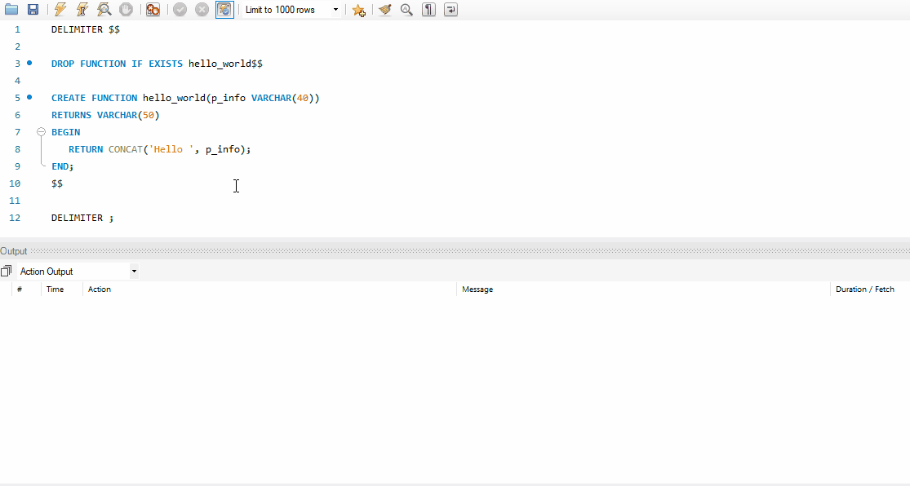
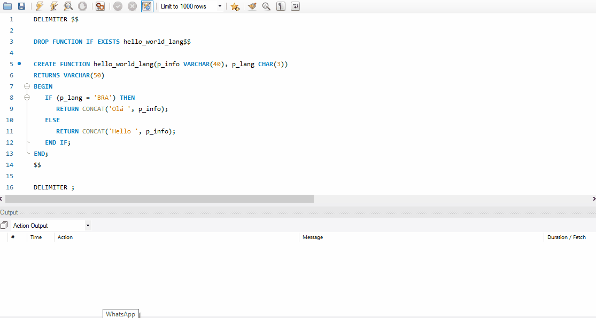
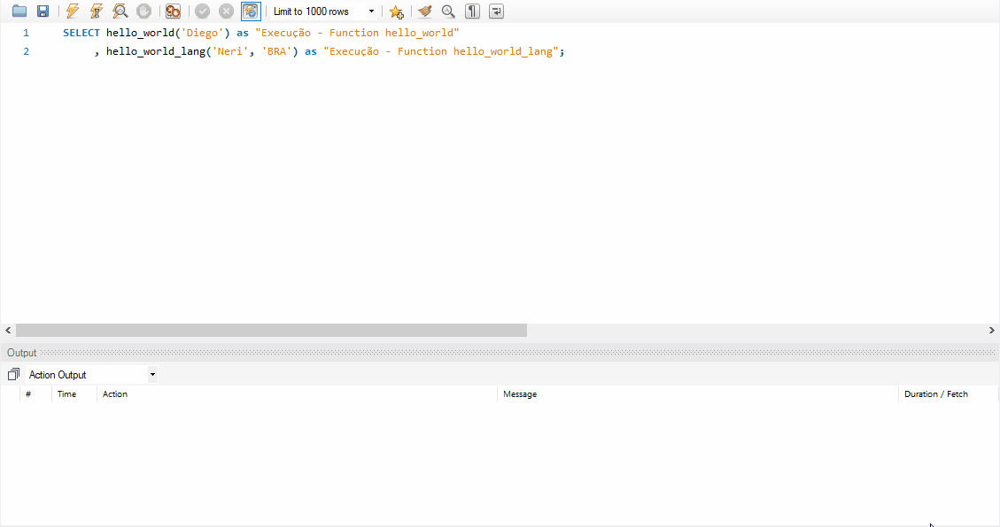
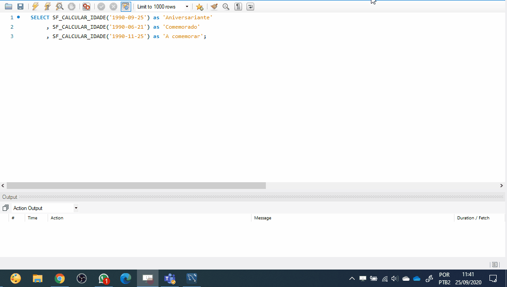

# MySQL - _Stored Functions_

* 📽 Veja esta vídeo-aula no Youtube (_EM BREVE_)
* [📚 Referência oficial](https://dev.mysql.com/doc/refman/8.0/en/stored-routines-syntax.html "Documentação oficial - Stored Functions")
* [⁉ FAQ - _Frequently Asked Questions_](https://dev.mysql.com/doc/refman/8.0/en/faqs-stored-procs.html "Perguntas gerais")

Índice

* [Sintaxe básica](#Sintaxe-básica "Sintaxe básica")
  * [Sintaxe de criação](#Sintaxe-de-criação "Sintaxe de criação")
    * [(NOT) DETERMINISTIC](#(NOT)-DETERMINISTIC "(NOT) DETERMINISTIC")
    * [Parâmetro log_bin_trust_function_creators](#Parâmetro-log_bin_trust_function_creators "Parâmetro log_bin_trust_function_creators")
  * [Sintaxe de execução](#Sintaxe-de-execução "Sintaxe de execução")
* [Exemplo](#Exemplo "Exemplo")
  * [Exemplo de criação](#Exemplo-de-criação "Exemplo de criação")
  * [Exemplos de execução](#Exemplos-de-execução "Exemplos de execução")
* [Exemplo prático - calcular idade](#Exemplo-prático---calcular-idade)
  * [Criação da function](#Criação-da-function)  
  * [Execução da function](#Execução-da-function)

## Sintaxe básica

<https://dev.mysql.com/doc/refman/8.0/en/stored-routines-syntax.html>
<https://dev.mysql.com/doc/refman/8.0/en/create-procedure.html>

### Sintaxe de criação

```sql
DELIMITER $$

DROP FUNCTION IF EXISTS nome_function$$

CREATE FUNCTION nome_function(<parametros, ...>) RETURNS <TIPO_RETORNO>
[<(NOT) DETERMINISTIC>]
BEGIN
   /*comandos;*/
   RETURN <TIPO_RETORNO>;
END;
$$

DELIMITER ;
```

#### (NOT) DETERMINISTIC

<https://dev.mysql.com/doc/refman/8.0/en/stored-programs-logging.html>

Este parâmetro é uma declaração para determinar se a function altera ou não dados, para fins de organização da base de dados em rotinas administrativas.

* `NOT DETERMINISTIC` --> são funções que alteram os dados de alguma forma, através de um update, insert ou delete. Esta declaração ajuda o banco de dados a entender se a _FUNCTION_ pode não ser segura para fins de _recovery_ ou replicação de uma base de dados.

* `DETERMINISTIC` --> são funções que **não** alteram os dados. Elas são ditas que são seguras para replicação ou recuperação de uma base de dados.

##### Parâmetro log_bin_trust_function_creators

O parâmetro log_bin_trust_function_creators faz com que o banco de dados confie nos usuários criadores de _Functions_, que eles vão adotar corretamente o parâmetro __DETERMINISTIC__ na criação do objeto.

Uma vez que o MySQL *não* verifica o conteúdo de uma _Function_, para saber se é _deterministic_ ou _not deterministic_, ele vai deixar a cargo do desenvolvedor a informação opcional do parâmetro.

* 0 --> DETERMINISTIC é obrigatório
* 1 --> DETERMINISTIC é opcional

Para nossos estudos, tornaremos o DETERMINISTIC como opcional:

```sql
SET GLOBAL log_bin_trust_function_creators = 1;
```

### Sintaxe de execução

```sql
SELECT nome_function(<parametros, ...>)
```

Obs: a execução também pode ser feita em outros locais, como por exemmplo, dentro de uma outra FUNCTION ou PROCEDURE.

## Exemplo

### Exemplo de criação

```sql
DELIMITER $$

DROP FUNCTION IF EXISTS hello_world$$

CREATE FUNCTION hello_world(p_info VARCHAR(40))
RETURNS VARCHAR(50)
BEGIN
   RETURN CONCAT('Hello ', p_info);
END;
$$

DELIMITER ;
```



Outro exemplo:

```sql
DELIMITER $$

DROP FUNCTION IF EXISTS hello_world_lang$$

CREATE FUNCTION hello_world_lang(p_info VARCHAR(40), p_lang CHAR(3))
RETURNS VARCHAR(50)
BEGIN
   IF (p_lang = 'BRA') THEN
      RETURN CONCAT('Olá ', p_info);
   ELSE
      RETURN CONCAT('Hello ', p_info);
   END IF;
END;
$$

DELIMITER ;
```



### Exemplos de execução

```sql
SELECT hello_world('Diego')
     , hello_world_lang('Neri', 'BRA');
```



## Exemplo prático - calcular idade

### Criação da function

```sql
DELIMITER $$
DROP FUNCTION IF EXISTS sf_calcular_idade $$
CREATE FUNCTION sf_calcular_idade(p_data DATE) RETURNS SMALLINT
BEGIN
   DECLARE v_ano SMALLINT;
   DECLARE v_mes SMALLINT;
   DECLARE v_dia SMALLINT;

   DECLARE v_data_atual DATE;
   DECLARE v_ano_atual SMALLINT;
   DECLARE v_mes_atual SMALLINT;
   DECLARE v_dia_atual SMALLINT;

   DECLARE v_idade SMALLINT;

   SELECT YEAR(p_data)
     INTO v_ano;
   SELECT MONTH(p_data)
     INTO v_mes;
   SELECT DAY(p_data)
     INTO v_dia;

    SET v_data_atual = CURRENT_DATE();
    SET v_ano_atual = YEAR(v_data_atual);
    SET v_mes_atual = MONTH(v_data_atual);
    SET v_dia_atual = DAY(v_data_atual);

   IF ( v_mes_atual > v_mes ) THEN
      SELECT ( v_ano_atual - v_ano )
        INTO v_idade;
   ELSEIF ( v_mes_atual < v_mes ) THEN
      SELECT ( ( v_ano_atual - v_ano ) -1 )
        INTO v_idade;
   ELSE
      IF ( v_dia_atual >= v_dia ) THEN
         SELECT ( v_ano_atual - v_ano )
           INTO v_idade;
      ELSE
         SELECT ( ( v_ano_atual - v_ano ) -1 )
           INTO v_idade;
      END IF;
   END IF;
   RETURN v_idade;
END $$
```

ou

```sql
DELIMITER $$
DROP FUNCTION IF EXISTS sf_calcular_idade $$
CREATE FUNCTION sf_calcular_idade(p_data DATE) RETURNS SMALLINT
BEGIN
   RETURN TIMESTAMPDIFF (YEAR,p_data,CURDATE());
END $$
```

Referência: <https://dev.mysql.com/doc/refman/8.0/en/date-calculations.html>

### Execução da function

```sql
SELECT SF_CALCULAR_IDADE('1990-09-25') as 'Aniversariante'
     , SF_CALCULAR_IDADE('1990-06-21') as 'Comemorado'
     , SF_CALCULAR_IDADE('1990-11-25') as 'A comemorar';
```


