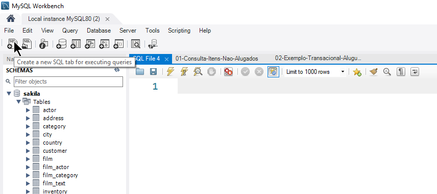
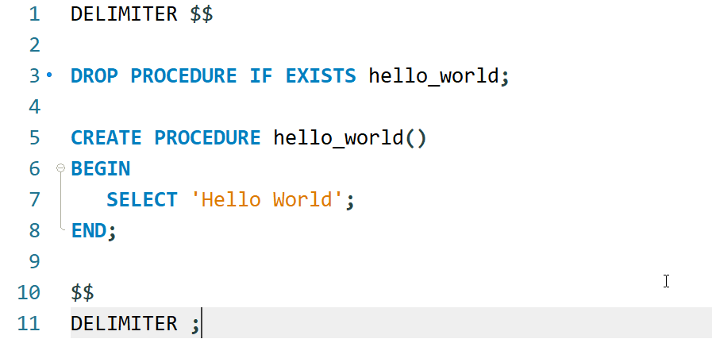
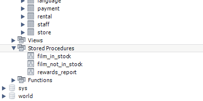
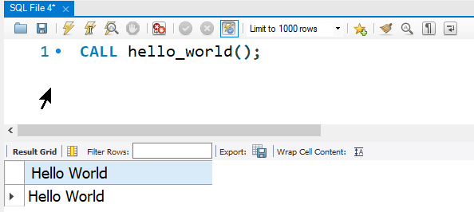

# MySQL - _Stored Procedures_

* [📽 Veja esta vídeo-aula no Youtube](https://youtu.be/NAwtsg_2xOA "Banco de Dados III | 04 - Stored Procedures")
* [📚 Referência oficial](https://dev.mysql.com/doc/refman/8.0/en/stored-programs-defining.html "Documentação oficial - Definindo um programa armazenado")
* [⁉ FAQ - _Frequently Asked Questions_](https://dev.mysql.com/doc/refman/8.0/en/faqs-stored-procs.html "Perguntas gerais")

Índice

* [Sintaxe](#Sintaxe "Sintaxe")
* [Exemplo de criação](#Exemplo-de-criação "Exemplo de criação")
* [Executando uma Stored Procedure](#Executando-uma-Stored-Procedure "Executando uma Stored Procedure")

## Sintaxe básica

<https://dev.mysql.com/doc/refman/8.0/en/stored-routines-syntax.html>
<https://dev.mysql.com/doc/refman/8.0/en/create-procedure.html>

### Criação

```sql
DELIMITER $$

DROP PROCEDURE IF EXISTS nomeproc;

CREATE PROCEDURE nome_procedure(<parametros, ...>)

BEGIN
   /*comandos;*/
END;
$$

DELIMITER ;
```

### Execução

```sql
CALL nome_procedure(<parametros, ...>)
```

## Exemplo de criação

No MySQL Workbench, abra uma nova aba SQL para executar queries:



Então, informe os comandos para a criação:

```sql
DELIMITER $$

DROP PROCEDURE IF EXISTS hello_world;

CREATE PROCEDURE hello_world()
BEGIN
   SELECT 'Hello World';
END;
$$

DELIMITER ;

```



> Reparem na linha branca ao final. Recomendo sempre ter uma linha em branco, pois se o script for executado via CLI, é necessária esta linha.

Para a execução, clique no raio __sem__ o cursor:


Veja o output de saída:


Para ver o novo objeto criado, no _Navigator_, localize abaixo do schema utilizado o item **Stored Procedures**, clique com o direito e selecione `Refresh All`:



Quanto a sintaxe utilizada:

1. `DELIMITER $$`
   * Altera o delimitador padrão para `$$`. Veja mais em [Delimitadores](delimitadores.md)
1. `DROP PROCEDURE IF EXISTS hello_world`
   * DROP --> eliminar
   * IF EXISTS --> se existir
   * Sintaxe utilizada para eliminar qualquer objeto com o mesmo nome na base de dados. É uma boa prática para que, na mudança do conteúdo do procedimento, não seja necessário utilizar o comando `ALTER PROCEDURE`;
1. `CREATE PROCEDURE hello_world()`
   * Cria uma _stored procedure_ chamada `hello_world`, **sem** parâmetros;
1. `BEGIN`
   * Declaração de início do procedimento
1. `END`
   * Declaração de término do procedimento  
1. `DELIMITER ;`
   * Retorna o delimitador padrão para `;`.

## Executando uma _Stored Procedure_

Para executar uma _Stored Procedure_, você deve utilizar o comando `CALL`. Para o exemplo acima:

```sql
CALL hello_world();
```


