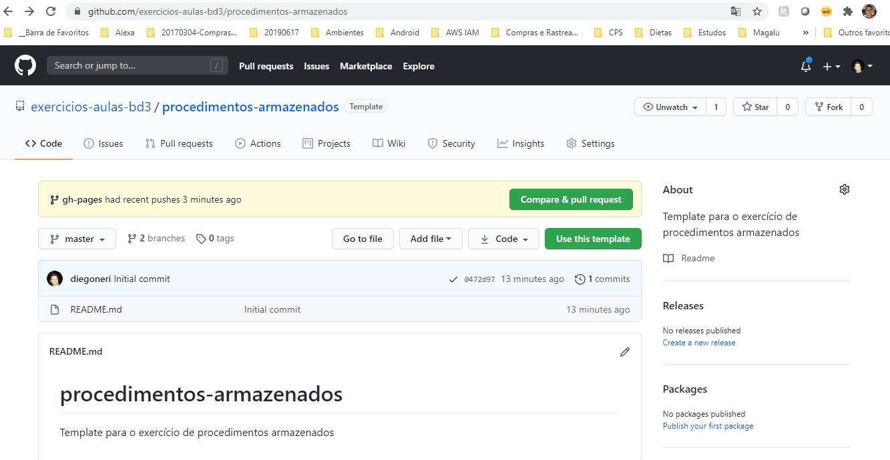
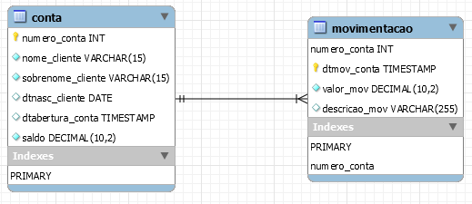

# Exercícios: Procedimentos armazenados

## Boas práticas para os exercícios

Use o repositório <https://github.com/exercicios-aulas-bd3/procedimentos-armazenados> como template.

* Para isso, acesse o repositório conforme link acima.
* Clique no botão "Use this template"
* Siga as instruções conforme animação abaixo:



Conforme cada pasta no repositório, salve cada objeto gerado pelo exercício abaixo na pasta solicitada:

* scripts --> para exercícios de análise, alterar o arquivo `scripts/load-script.sql` com melhorias para o script.
* functions --> para cada function criada, criar um script.sql conforme nomenclatura do exercício.
* procedures --> para cada procedure criada, criar um script.sql conforme nomenclatura do exercício.
* triggers --> para cada trigger criada, criar um script.sql conforme nomenclatura do exercício.

Por exemplo, se o exercício disser:

```[sp_contar_numeros]``` Defina a instrução que ...

Salvar na pasta **procedures** o arquivo `sp_contar_numeros.sql`.

Prefixos:

* sp_ --> procedures ou stored procedures
* f_ --> functions ou stored functions
* t_ --> triggers

No Teams, deverá ser informado o link do repositório apenas, para o caso acima, deveria ser fornecido o link (<https://github.com/SEU_USUARIO/procedimentos-armazenados>)

---

## Modelo de dados - bancário



O arquivo `scripts/load-script.sql` possui a criação da base de dados e da tabela acima representada, assim como alguns inserts de novas contas.

Executar o script para carregar a base no seu MySQL e faça os exercícios a seguir.

## Exercícios

---

`1. [analise_criacao_objetos]` Analise o script `scripts/load-script.sql` quanto a criação de objetos. Altere-o caso julgue necessário, caso necessite melhorias.

Possíveis melhorias:

* Melhorar a normalização das tabelas
* Alterar nomenclatura de campos
* Alterar tipo de dado de campos
* Adicionar chaves
* Adicionar comandos que melhorem a execução do script

Objetivo: Testar sua capacidade analítica para revisar o trabalho de outros desenvolvedores.

---
`2. [sp_deposito]` Crie uma procedure que faça um depósito na conta. As especificações dela são:

* `Parâmetros de entrada`: p_conta e p_valor
* `Parâmetros de saída`: N/A
* `Pseudocódigo`
  * Dada a conta de entrada, verifique se a conta existe.
    * Verifique se `p_valor` é maior que zero. Se sim, continue a execução, senão exiba a mensagem `Valor inválido para a operação.`
    * Caso não exista, exiba a mensagem `Conta inexistente.`
    * Caso exista:
      1. Inicie uma transação (_start transaction_);
      2. Atualize a conta, adicionando o valor à conta.
      3. Crie uma nova movimentação, informando:
        - p_conta
        - data atual
        - p_valor
        - Descrição `'Depósito de ' + p_valor`
      4. Persista a transação (_commit_);

---
`2. [sp_saque]` Crie uma procedure que faça um saque na conta. As especificações dela são:

* `Parâmetros de entrada`: p_conta e p_valor
* `Parâmetros de saída`: N/A
* `Pseudocódigo`
  * Dada a conta de entrada, verifique se a conta existe.
    * Verifique se `p_valor` é maior que zero. Se sim, continue a execução, senão exiba a mensagem `Valor inválido para a operação.`  
    * Caso não exista, exiba a mensagem `Conta inexistente.`
    * Caso exista:
      * Verifique o saldo da conta. 
        * Se o saldo for menor que `p_valor`, exiba a mensagem , exiba a mensagem `Saldo insuficiente.`
        * Senão:
          1. Inicie uma transação (_start transaction_);
          2. Atualize a conta, subtraindo o valor da conta.
          3. Crie uma nova movimentação, informando:
            - p_conta
            - data atual
            - p_valor
            - Descrição `'Saque de ' + p_valor`
          4. Persista a transação (_commit_);

---
`3. [f_transferencia]` Crie uma function que faça uma transferência entre contas. As especificações dela são:

* `Parâmetros de entrada`: p_conta_origem, p_conta_destino e p_valor
* `Retorno`: v_mensagem_resultado
* `Pseudocódigo`
  * Dada as contas de origem e destino, verifique a existência das mesmas.
    * Verifique se `p_valor` é maior que zero. Se sim, continue a execução, senão atribua `Valor inválido para a operação.` para v_mensagem_resultado
    * Caso não exista, exiba a mensagem `Conta de origem inexistente.` ou `Conta de origem inexistente.` conforme o caso e atribua para `v_mensagem_resultado`
    * Caso as contas existam:
      * Verifique o saldo da conta origem. 
        * Se o saldo for menor que `p_valor` atribua `Saldo insuficiente.` para v_mensagem_resultado;
        * Senão:
          1. Inicie uma transação (_start transaction_);
          2. Atualize a conta de origem, subtraindo o valor da conta de origem.
          3. Atualize a conta de destino, adicionando o valor à conta destino.
          4. Crie uma nova movimentação, informando:
            - p_conta_origem
            - data atual
            - p_valor
            - Descrição `'Transferência para ' + p_conta_destino + ' de ' + p_valor`
          5. Crie uma nova movimentação, informando:
            - p_conta_destino
            - data atual
            - p_valor
            - Descrição `'Transferência de ' + p_conta_origem + ' de ' + p_valor`            
          6. Persista a transação (_commit_);
          7. Atribua `Transferência efetuada com sucesso!` para `v_mensagem_resultado`;
        * Retorne `v_mensagem_resultado`;

---
`4. [t_nova_conta]` Salve o exemplo de aula da trigger t_nova_conta.

---
`5. [t_registra_nova_conta]` Salve o exemplo de aula da trigger t_registra_nova_conta.

---
`6. [t_altera_conta]` Salve o exemplo de aula da trigger t_altera_conta.

---
`7. [t_nova_conta]` Altere a trigger t_nova_conta, de forma a adicionar a dtabertura_conta como a data e hora do de sistema.
